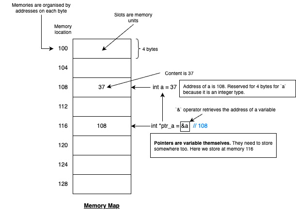

# Structure and classes
-   [Struct](./structure.cpp)
-   [Class](./class.cpp)
- [Header and Implementation](./cow_demo/)
- [Pointers](./pointers.cpp)
- [References](./references.cpp)
- [Vectors](./vectors.cpp)

# More on Pointers
### What are pointers?
Pointers are variables that hold memory addresses.

For example, we have a slice of memory with addresses from 100 - 128, as shown in the image. 
- When declaring a variable, a slice of memory space is reserved in the memory. e.g. Slice 108 - 112 is reserved for `int a`. The value (37) will be stored in this slice of memory. 
- A pointer is a variable that can store the address. e.g. We can declare a pointer `int *ptr_a` with the value `&a`. The `&` operator returns the address of `a`. i.e., this stores the address of `a` into `ptr_a`. 
- Since pointer is an object, we also need to reserve a space to store this pointer. Say, as illustrated in the diagram, this pointer is stored in memory block 116 - 120. 

For example, in a 32-bit architectures, pointers are 32 bits wide.  

### Usage of Pointers
One of the most important usage of pointer is dynamic memory management. 
When you declare a variable, you are statically allocating memory for it. The compiler knows the space in memory that will be needed (by the variable type)

However, most real applications create variables and objects in memory during runtime. This is known as **Dynamic memory management**. 

In C, it is common to allocate memory dynamically using the `malloc` family of functions. `malloc` is short for **"Memory Allocation"**. 

As a programmer, we are responsible of freeing up the memory allocated in runtime to avoid **memory leakage**. 

### Dynamic Memory Allocation in Class and Objects
In C++, pointers are used for dynamically allocating the memory for new objects when calling the class constructor, and also to free up the memory when we no longer need them. 

We will showcase how to use it in the [cow demo code](./cow_demo/code_demo.cpp) - Pointer Demonstration section. 

# References
References are alias to existing variables. To create a reference, you simply declare the type you want followed by an `&`. 
- Once declared, references uses the same syntax as the referenced variables.
- We don't have to de-reference as a pointer. We use the variable just like the original variable. 

### References are not pointeres
- Although they look similar, references are not pointers. We don't store a reference in the memory. 
- Hence, references do not have addresses. 
    - There are no array of references (To index an element in an array, you need an address)
    - There are no pointer to references (Because there is no address)
    - There are also no references to references. Even if you do so, they will be the alias to the same existing variables. 
- References are also not objects

### Pointers vs References
|Pointers|References|
|--------|----------|
|Initialisation is optional|Must be initialised at declaration|
|Can point to different objects|Cannot reference a second object|
|Can be void or NULL|Have a fixed type and object|
|Have multiple levels of indirection|Only one level of indirection|
|Must be dereferenced to access the data|No need for dererencing|

### Useful applications for references
- Passing parameters by reference (Will be covered in functions)
- So it avoids copying large objects as functional parameters
- Same apply to for loops - it avoids copying large objects in for loops
